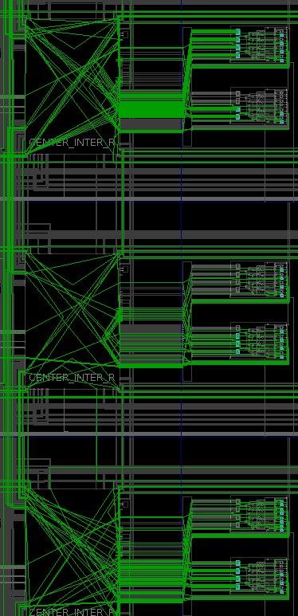
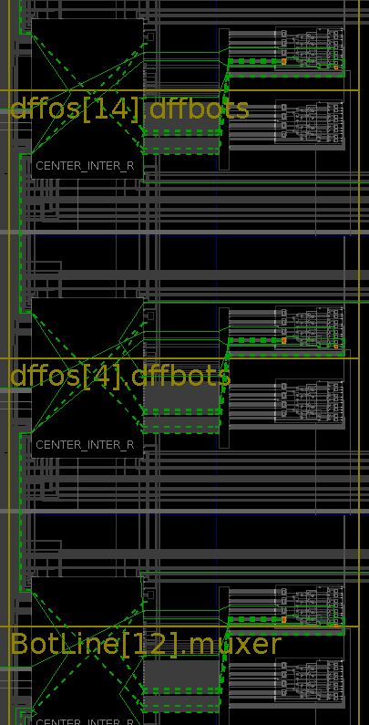

### System Requirements: Linux, Vivado Design Suite 18.1 or later
The system can be run in both "Project Mode" and "Non-Project Mode" of Vivado Design Suite. It is recommented to choose "Non-Project Mode" for automation.

The following are the steps to execute the entire system:
1. Open a shell-terminal and configure it for serial communication using the following commands:     (Install *cat*, *stty*, *hexdump* packages, if they are missing)
  > **stty -F /dev/ttyUSB1 9600 cs8 -ixon ixoff -parenb -echo -cstopb crtscts -opost -onlcr -isig -icanon -echoe -icrnl**
  - Open an empty file for storing the Challenge Response Pairs (CRPs)
  > **cat > CRPfilename < /dev/ttyUSB1**
    
2. Open *Vivado Design Suite*
- Go to **File** \-\> **Checkpoint** \-\> **Open**
- Choose *post_synth.dcp* from the parent directory
- The, Go to **Flow** \-\> **Run Implementation**
  
3. After successful implementation, in the bottom pane, expand **Tcl Console**
-The TCL ( Tool Command Language) script must be sourced, which is located in the parent directory as **"FirstXilTclMigNpm.tcl"**.
This file mut be sourced in the **Tcl Console** with the following command:
  >**source "Absolute/Patht/To/File/FirstXilTclMigNpm.tcl"**

4. Go to **Window** -\>\ **Device** and observe the entire implementation. A zoomed in view must look like below figures:
<figure>
    
    <figcaption>Before sourcing the TCL script</figcaption>
</figure>

<figure>
    
    <figcaption>After sourcing the TCL script</figcaption>
</figure>

5. The CRP data will be logged in the file created using *cat* in step 1. For post processing dump this binary file into hexadecimal format:
  > **hexdump -v -e '10/1 "%02x""\n"' CRPfilename > CRPfilename.txt**
   - CRPfilename.txt will be in human-readable form and can be viewed with any editor (*gedit*, *vim* etc)

6. This file can be used to evaluate the Quality metrics of the PUF design.

>>>For any further queries, write to <sreekanthbv@iitkgp.ac.in>
